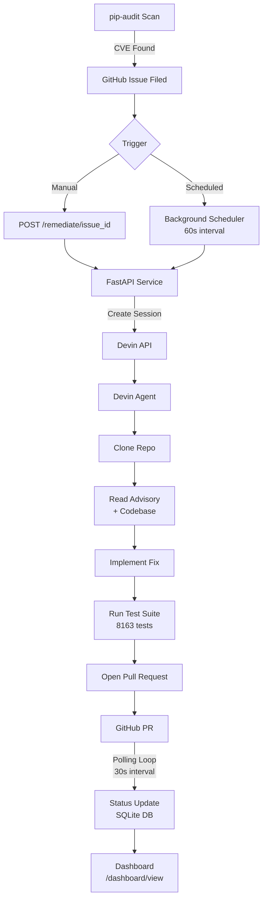
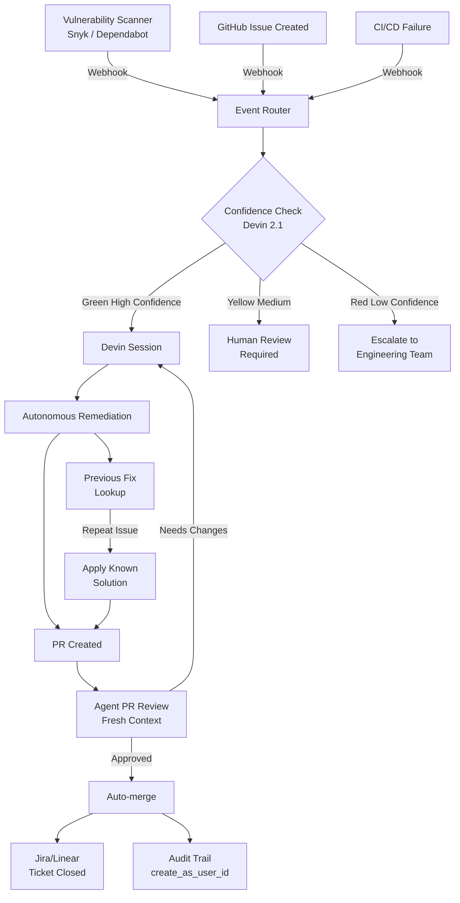

# Devin Remediation Service

An event-driven automation service that uses the [Devin API](https://docs.devin.ai/api-reference/overview) to autonomously remediate security vulnerabilities in Apache Superset, with built-in observability into session status, outcomes, and estimated engineering time saved.

## The Problem
Identifying vulnerabilities is a relatively solved problem. Organizations already have scanners that surface dependency issues, CVEs, and security findings. The harder problem is remediation.

Someone still has to understand the vulnerability, determine whether it's actually relevant to the codebase, implement a fix, validate that nothing broke, and create a pull request that can be reviewed and merged.

## Trigger Design

The service is designed to be triggered by engineering events such as vulnerability scan findings, issue creation, or repository activity. For the purposes of this demo, I exposed a manual trigger endpoint to simulate those events and included a background scheduler to demonstrate unattended operation.

## How It Works
1. A background scheduler runs every 60 seconds and checks for any known issues that haven't been remediated yet
2. When it finds one (or when triggered manually via the `/remediate/{issue_id}` endpoint), it creates a Devin session with a detailed, context-aware prompt
3. Devin autonomously reads the codebase, understands the advisory, implements the fix, runs the test suite, and opens a pull request
4. A polling loop checks each active session every 30 seconds and updates the database when Devin completes, capturing the PR link
5. A dashboard at `/dashboard/view` shows real-time status of all sessions, success rates, and estimated engineering hours saved

## Architecture



## Potential Expansion



## Setup & Running Locally

### Prerequisites
- Python 3.11+
- A [Devin API key](https://app.devin.ai/org/settings/devin-api)

### Install dependencies
```bash
pip install -r requirements.txt
```

### Set your Devin API key
```bash
export DEVIN_API_KEY="your_key_here"
```

### Run the service
```bash
uvicorn main:app --reload
```

The service will start on `http://localhost:8000`.

## Running with Docker

### Build the image
```bash
docker build -t devin-remediation-service .
```

### Run the container
```bash
docker run -p 8000:8000 -e DEVIN_API_KEY="your_key_here" devin-remediation-service
```

## Key Endpoints

| Endpoint | Method | Description |
|----------|--------|-------------|
| `/` | GET | Health check |
| `/issues` | GET | List all configured issues |
| `/remediate/{issue_id}` | POST | Manually trigger remediation for an issue (`flask`, `cryptography`, `pyjwt`) |
| `/dashboard` | GET | Raw JSON observability data |
| `/dashboard/view` | GET | Visual dashboard showing session status, PRs, and estimated hours saved |

## Superset Fork
The target repository is [remikauderer22/superset](https://github.com/remikauderer22/superset), a fork of Apache Superset. Three security vulnerabilities were identified via `pip-audit`, filed as issues, and remediated by Devin:

- [Issue #4](https://github.com/remikauderer22/superset/issues/4) → [PR #1](https://github.com/remikauderer22/superset/pull/1): Flask CVE-2026-27205
- [Issue #5](https://github.com/remikauderer22/superset/issues/5) → [PR #3](https://github.com/remikauderer22/superset/pull/3): cryptography GHSA-537c-gmf6-5ccf  
- [Issue #6](https://github.com/remikauderer22/superset/issues/6) → [PR #2](https://github.com/remikauderer22/superset/pull/2): PyJWT CVE-2026-48524

## Future Extensions

The current system proves the core technical loop. A production deployment would extend this in several directions:

- **Real event triggers** — replace the background scheduler with GitHub webhooks, vulnerability scanner callbacks (Snyk, Dependabot), or CI/CD pipeline events so remediation fires automatically the moment an issue is detected
- **Confidence-gated sessions** — use Devin 2.1's 🟢🟡🔴 confidence scoring to evaluate issues before committing to a full session; only auto-trigger on high-confidence findings, escalate others for human review
- **Multi-agent PR review** — have a second Devin session review the PR with fresh context before auto-merging, reducing the risk of incorrect fixes reaching production
- **Ticketing system integration** — connect to Jira or Linear via MCP so remediation sessions are tied to existing engineering workflows and tickets close automatically when PRs merge
- **Audit trail via create_as_user_id** — attribute each Devin session to a specific engineer so there's always a named human accountable for each remediation, satisfying compliance and traceability requirements
- **Repeat issue detection** — before starting a session, query previous fixes for similar issues so Devin can reference its own prior solutions rather than starting from scratch
- **Guardrails** — add prompt injection detection, PII scrubbing on issue content before sending to Devin, drift monitoring across sessions, and hallucination checks on PR descriptions before they're posted
- **v3 API migration** — migrate from the legacy v1 API to Devin's v3 API for RBAC, session attribution, and access to newer features including structured confidence scores

## Notes
- The scheduler interval is set to 60 seconds for demo purposes; a production deployment would use a longer interval (hourly or daily)
- `estimated_hours_saved` is based on manual effort estimates set per issue at filing time, not measured data
- Flask was initially remediated via a direct API call during development before the orchestration layer was finalized; cryptography and PyJWT were triggered through the live service
- Docker requires macOS 14.0+ locally; tested successfully via GitHub Codespaces on Ubuntu
- Confidence scoring (Devin 2.1 🟢🟡🔴) is not yet surfaced in the v1 API used here; a production migration to v3 would enable gating sessions on confidence before committing ACUs
